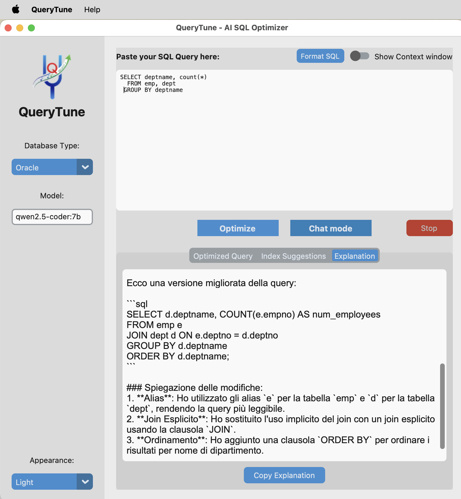

# QueryTune

 QueryTune is a native macOS application designed to optimize SQL queries using Large Language Models (LLMs). It supports both **local models** (via Ollama) and **cloud services** (OpenAI API compatible), providing developers and DBAs with a powerful tool to refactor SQL code, suggest indices, and improve database performance.

## 🚀 Features

- **Dual Analysis Modes:**
  - **Optimize:** Generates structured results including a refactored query, index suggestions, and technical explanations.
  - **Chat Mode:** Provides a conversational, streaming experience (word-by-word) for general query analysis and brainstorming.
- **Context Awareness:** Add specific instructions, table sizes, or schema details in the collapsible "Context" area to improve AI accuracy.
- **Hybrid AI Processing:** 
  - **Local:** Connects to your local Ollama instance (100% private).
  - **Cloud:** Full support for OpenAI (GPT-4o, etc.) or any OpenAI-compatible API (Groq, LM Studio).
- **Settings Persistence:** Remembers your preferred Model, Database Type, Theme, API Keys, and Font settings.
- **Advanced SQL Formatting:** Customize indentation, keyword casing, and styling (comma-first, compact SELECT).
- **Connection Diagnostics:** Test your AI endpoint directly from the settings menu.
- **Native macOS Experience:** Clean interface with dark mode support, native menus (About/Preferences), and optimized build for Apple Silicon and Intel.

## 🖥️ Graphical User Interface

QueryTune uses the native MacOS user inferface. One picture is worth a thousand words:



In Chat Mode QueryTune can describe the results in any language the LLM knows.

## 🛠 Technical Stack

- **Language:** Python 3.13
- **GUI Framework:** [CustomTkinter](https://github.com/TomSchimansky/CustomTkinter)
- **AI Backend:** OpenAI-compatible API (Ollama v1, OpenAI API, etc.)
- **Packaging:** PyInstaller + `create-dmg`

## 📦 Getting Started

### Prerequisites

1.  **AI Provider:** 
    - **Local:** Install [Ollama](https://ollama.com/) and pull a model (e.g., `ollama pull qwen2.5-coder:7b`).
    - **Cloud:** Obtain an API Key from [OpenAI](https://platform.openai.com/).
2.  **Python & Tkinter:**

    ```
    brew install python@3.13 python-tk@3.13
    ```

### Development Setup

1.  **Clone the repository.**

2.  **Create and activate a virtual environment (recommended):**

    ```
    python -m venv venv
    source venv/bin/activate
    ```

3.  **Install dependencies:**

    ```
    pip install -r requirements.txt
    ```

4.  **Run the application:**

    ```
    python main.py
    ```

### Packaging for macOS

To create a standalone `.app` and a `.dmg` installer using the current environment:
```bash
./build_macos.sh
```


## 🎶 Tuning

### Recommended Models

Choosing the right LLM is crucial for high-quality optimizations. Below are the tested models compatible with QueryTune:

| Model Name (Ollama/API) | Local | Best For | Suggested Temp | Available since |
|-------------------------|-------|----------|----------------|-----------------|
| `qwen2.5-coder:7b` | **X** | Default. Balanced speed and excellent SQL logic.  [collabnix](https://collabnix.com/best-ollama-models-for-developers-complete-2025-guide-with-code-examples/) | 0.1 | 2024-09 |
| `deepseek-r1:8b` | **X** | Reasoning-based analysis. Great for explanations.  [ollama](https://ollama.com/library/deepseek-r1) | 0.6 | 2025-07 |
| `deepseek-r1:14b` | **X** | High-quality reasoning for complex multi-join queries. Requires more memory. [ollama](https://ollama.com/library/deepseek-r1:14b) | 0.6 | 2025-07 |
| `llama3.1:8b` | **X** | SQL generation and text-to-SQL; reliable speed/quality balance.  [ollama](https://ollama.com/library/llama3.1:8b) | 0.2 | 2024-07 |
| `codestral:22b` | **X** | Code completion, SQL refactoring multi-language.  [ollama](https://ollama.com/library/codestral:22b) | 0.1 | 2024-05 |
| `deepseek-coder:33b` | **X** | Complex query optimization and algorithms.  [codegpt](https://www.codegpt.co/blog/choosing-best-ollama-model) | 0.3 | 2024-01 |
| `qwen3-coder-next:cloud` | | Top cloud coder, Ollama interface. SQL opt + agentic | 0.2 | 2026-02 |
| `gpt-4o` | | Cloud-based, very fast and reliable generalist.  [codegpt](https://www.codegpt.co/blog/best-ollama-model-for-coding) | 0.0 | 2024-05 |
| `gpt-4o-mini` | | Fast/economic for daily tuning; lighter 4o alternative.  [codegpt](https://www.codegpt.co/blog/best-ollama-model-for-coding) | 0.0 | 2024-07 |
| `claude-3-5-sonnet` | | Exceptional at following complex refactoring rules.  [leadingtorch](https://www.leadingtorch.com/2025/12/09/text-to-sql-performance-a-head-to-head-comparison-of-llama-3-1-qwen-2-5-and-gpt-4-5-turbo/) | 0.0 | 2024-06 |
| `claude-3-7-sonnet` | | Evolved Sonnet for advanced rules.  [leadingtorch](https://www.leadingtorch.com/2025/12/09/text-to-sql-performance-a-head-to-head-comparison-of-llama-3-1-qwen-2-5-and-gpt-4-5-turbo/) | 0.0 | 2025-11 |

> **Pro Tips:** For SQL optimization, always keep the temperature low (0.0 - 0.2) to ensure syntactic correctness, except for "Reasoning" models like DeepSeek-R1 which perform better with slightly higher temperature.

> Prioritize local 7-14B models (Q4/Q5 quantized) to avoid swap.

> Update Ollama regularly for newer quantizations and model tags. [ollama](https://ollama.com/library/deepseek-r1)

### Best Practices for Context & Tuning

*   **Surgical Context**: Provide only the DDL (`CREATE TABLE`) of the tables actually involved in the query. Adding unrelated schemas increases noise and the risk of hallucinations.
*   **Data Statistics**: Explicitly state table sizes (e.g., *"Table A has 10M rows, Table B has 500 rows"*). This is critical for the AI to suggest the correct join order and strategy.
*   **Identify Constraints**: Inform the AI about specific limits, such as *"Do not use window functions"* or *"The table is read-only, I cannot add indices"*.
*   **Context Window**: For long or complex queries, prefer models with at least **32k context** (like Qwen 2.5/3 or Claude) to avoid the "lost in the middle" effect where the AI forgets the beginning of the prompt.
*   **Model Choice**: Use local models (`7b` to `14b`) for privacy and speed on standard tasks. Switch to "Cloud" or larger reasoning models (`DeepSeek-R1` or `Qwen3-Next`) for architectural refactoring and multi-page complex queries.

---

## 🏗 Roadmap

- [ ] **DDL Integration:** Automatic schema parsing from SQL files to provide even more context.
- [ ] **History Log:** Save and browse previous optimizations.
- [ ] **Visual Diff:** Side-by-side comparison between original and optimized queries.

## 📄 License

Apache License 2.0 - See [LICENSE](LICENSE) for details.
