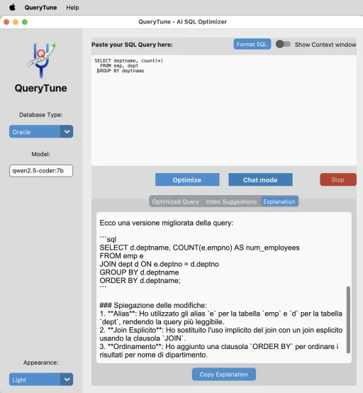

#  QueryTune Documentation

Welcome to the official documentation for **QueryTune**, the cross-platform AI-powered SQL optimizer.

QueryTune helps developers and DBAs transform slow, unoptimized SQL queries into efficient, well-structured code using the power of Large Language Models (LLMs).

## Quick Navigation

*   [**Usage Guide**](usage.md) - Learn how to optimize queries and use Chat or Optimize Mode.
*   [**Setup & Troubleshooting**](troubleshooting.md) - How to connect Ollama or Cloud APIs and fix common issues.
*   [**Best Practices**](best-practices.md) - Tips for getting the best results from AI.

## Why QueryTune?

Standard SQL formatters only fix indentation. QueryTune goes deeper:
1.  **Logical Refactoring:** Suggests better JOIN strategies and WHERE clause optimizations.
2.  **Indexing Advice:** Identifies missing indexes based on your schema.
3.  **Privacy First:** Supports 100% local processing via Ollama.
4.  **Language:** QueryTune speaks your language too (if LLM does)!

---
*QueryTune is open-source software licensed under the Apache License 2.0.*
